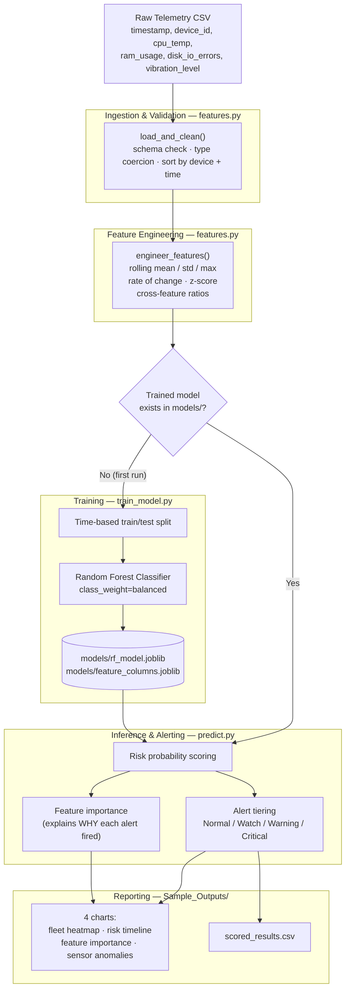

# AnomalyX

### Predictive Equipment Maintenance & Anomaly Alert System

An end-to-end machine learning pipeline that analyzes server/IoT telemetry (CPU temperature, RAM usage, disk I/O errors, vibration) to predict equipment downtime risk **before it happens**, and explains *why* using feature importance — so engineers know exactly what to fix.

[](https://www.python.org/)
[](https://scikit-learn.org/)
[](https://pandas.pydata.org/)
[](https://numpy.org/)
[](https://matplotlib.org/)
[](https://pytest.org/)
[](https://github.com/features/actions)
[](LICENSE)

---

## What This Project Does

```
Raw sensor CSV → Rolling-window feature engineering → Random Forest risk scoring
       → Alert tiers (Normal / Watch / Warning / Critical) → Explainable charts
```

1. **Extracts time-series window statistics** — rolling mean, rolling std, rate of change, and z-scores per sensor per device.
2. **Predicts downtime risk** using a Random Forest Classifier trained to recognize the pattern of readings that typically precede a failure.
3. **Computes feature importance** so you know *which sensor pattern* is driving each alert — not just a black-box score.

---

## Architecture



**How the pieces map to files:**

| Stage | File | Responsibility |
|---|---|---|
| Ingestion & Validation | `MAIN/features.py` → `load_and_clean()` | Checks required columns exist, parses timestamps, coerces sensor values to numeric, sorts per device |
| Feature Engineering | `MAIN/features.py` → `engineer_features()` | Computes rolling-window statistics per device — this is what turns raw noisy readings into a "trend fingerprint" |
| Training (one-time / on-demand) | `MAIN/train_model.py` | Time-based split → Random Forest fit → evaluation (precision/recall/ROC-AUC/PR-AUC) → saves model artifacts |
| Inference & Alerting | `MAIN/predict.py` | Loads the saved model, scores new data, assigns alert tiers, pulls feature importances |
| Reporting | `MAIN/predict.py` → `make_visualizations()` | Renders the 4 charts and the scored CSV into `Sample_Outputs/` |

**Design decisions worth knowing:**
- **`features.py` is shared** between `train_model.py` and `predict.py` so the exact same transformations are applied at training time and prediction time — the most common source of silent bugs in ML pipelines is these two drifting apart.
- **Time-based train/test split, not random shuffling** — the test set is always chronologically *after* the training set, so the model is never evaluated on data it could have "seen the future" of.
- **Lazy model training** — `predict.py` checks if `models/rf_model.joblib` exists; if not, it trains one automatically before analyzing your file, so there's no separate setup step required.

---

## Project Structure

```
AnomalyX/
├── MAIN/
│   ├── features.py        # shared feature-engineering logic (used by both scripts below)
│   ├── train_model.py     # trains the Random Forest on the synthetic dataset
│   └── predict.py         # ⭐ MAIN EXECUTABLE — interactive analysis entry point
├── synthetic_telemetry_dataset.csv   # bundled training dataset (10 devices, 30 days)
├── sample_input.csv        # small sample file for quick testing
├── models/                 # trained model artifacts get saved here (auto-created)
├── Sample_Outputs/          # generated charts + scored results get saved here (auto-created)
├── test_features.py        # pytest unit tests (repo root)
├── .github/workflows/
│   └── ci.yml              # GitHub Actions CI pipeline
├── requirements.txt
├── requirements-lock.txt   # pinned versions for exact metric reproducibility
├── LICENSE
└── README.md
```

---

## Getting Started

### 1. Clone and install dependencies

```bash
git clone https://github.com/<your-username>/AnomalyX.git
cd AnomalyX
pip install -r requirements.txt
```

> **Want to reproduce the exact metrics quoted in this README** (PR-AUC 0.98, ROC-AUC 0.999, etc.)? `requirements.txt` only sets minimum versions, so results can drift as libraries update. Install `requirements-lock.txt` instead for the exact pinned versions this project was verified against:
> ```bash
> pip install -r requirements-lock.txt
> ```

### 2. Run the analysis (interactive)

Just run the main script — it will prompt you for a file:

```bash
python MAIN/predict.py
```

```
=================================================================
  ANOMALYX
  Predictive Equipment Maintenance & Anomaly Alert System
=================================================================

Required columns: timestamp, device_id, cpu_temp, ram_usage,
                  disk_io_errors, vibration_level

Enter the path to your telemetry CSV file [press Enter to use bundled sample: sample_input.csv]:
```

- Press **Enter** to instantly analyze the bundled sample file, **or**
- Type the path to your own telemetry CSV (e.g. `data/my_server_logs.csv`)

The first time you run it, there's no trained model yet — the script automatically trains one on the bundled synthetic dataset before analyzing your file. Every run after that reuses the saved model in `models/`.

### 3. (Optional) Retrain the model manually

```bash
python MAIN/train_model.py
```

### 4. Run the test suite

```bash
pytest tests/ -v
```

---

## Input File Format

Your CSV must contain these columns (extra columns are ignored):

| Column | Type | Description |
|---|---|---|
| `timestamp` | datetime | e.g. `2026-08-01 00:05:00` |
| `device_id` | string | Unique identifier for each machine |
| `cpu_temp` | numeric | CPU temperature (°C) |
| `ram_usage` | numeric | RAM usage (%) |
| `disk_io_errors` | numeric | Disk I/O error count |
| `vibration_level` | numeric | Vibration sensor reading |

> Each device needs **at least 12 consecutive readings** (1 hour of data at 5-minute intervals) for the rolling-window features to compute.

---

## Sample Output

Running `predict.py` on the bundled sample produces a terminal summary like this:

```
[Step 4/4] Analysis Summary
-----------------------------------------------------------------
  Normal    :     165 readings  (68.75%)
  Watch     :       1 readings  ( 0.42%)
  Warning   :      10 readings  ( 4.17%)
  Critical  :      64 readings  (26.67%)

  Total Warning/Critical alerts: 74

  Devices with the highest average risk:
    - SRV-001: avg risk probability 0.98
    - SRV-004: avg risk probability 0.92

  Highest single risk reading: SRV-001 at 2026-08-01 05:45:00 — probability 1.00 (Critical)
-----------------------------------------------------------------
```

...and saves 4 charts + a scored CSV to `Sample_Outputs/`:

| Chart | What it shows |
|---|---|
| `1_fleet_risk_heatmap.png` | Devices × time heatmap — spot fleet-wide risk patterns at a glance |
| `2_risk_timeline_top_device.png` | Risk score over time for the highest-risk device, color-banded by alert tier |
| `3_feature_importance.png` | Which sensor patterns the model relies on most — the "why" behind the score |
| `4_sensor_trend_anomalies.png` | Raw sensor trend with rolling ±1σ band and flagged anomalies |

---

## Model Details

- **Algorithm:** Random Forest Classifier (`scikit-learn`)
- **Class imbalance handling:** `class_weight="balanced"` (failures are naturally rare events)
- **Validation strategy:** Time-based train/test split — the model is always tested on data *chronologically after* its training data, never on randomly shuffled data, to avoid leaking future information
- **Evaluation metrics:** Precision, Recall, F1, ROC-AUC, and PR-AUC (PR-AUC is emphasized since it's more informative than accuracy on imbalanced data)

On the bundled synthetic dataset, the model achieves **~0.98 PR-AUC** and **99% recall** on held-out future data — meaning it catches almost every simulated failure ramp before it happens.

---

## Tech Stack

| Purpose | Library |
|---|---|
| Data handling | pandas, NumPy |
| Modeling | scikit-learn (Random Forest) |
| Visualization | Matplotlib |
| Model persistence | joblib |
| Testing | pytest |
| CI/CD | GitHub Actions |

---

## Contributing

Issues and pull requests are welcome. Please run `pytest tests/ -v` before submitting a PR — the CI pipeline will run the same checks automatically on every push.

## License

This project is licensed under the [MIT License](LICENSE).
